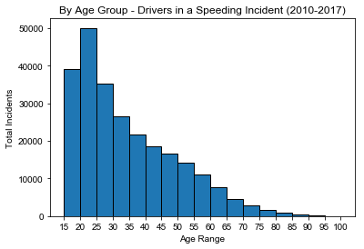
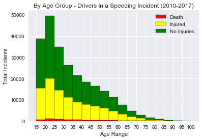
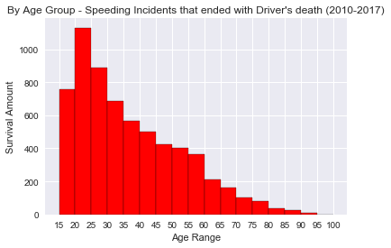
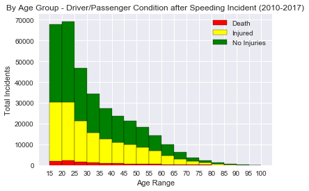
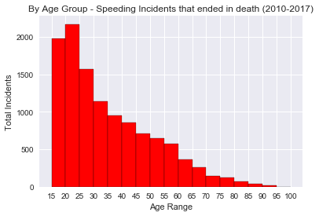
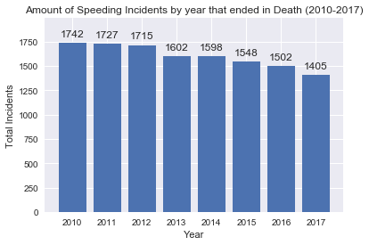
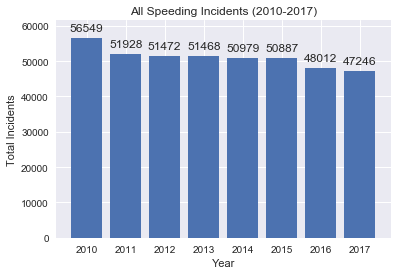

```python
# Import deficiencies
import pandas as pd
import tweepy
import json
import numpy as np
import matplotlib.pyplot as plt
import seaborn as sns
import time
import os
from matplotlib.dates import date2num
import datetime
```


```python
# Inputting all CSV data and read it into pandas
tx_2010 = os.path.join('TX 2010 Speed Related Crashes Data.csv')
tx_2011 = os.path.join('TX 2011 Speed Related Crashes Data.csv')
tx_2012 = os.path.join('TX 2012 Speed Related Crashes Data.csv')
tx_2013 = os.path.join('TX 2013 Speed Related Crashes Data.csv')
tx_2014 = os.path.join('TX 2014 Speed Related Crashes Data.csv')
tx_2015 = os.path.join('TX 2015 Speed Related Crashes Data.csv')
tx_2016 = os.path.join('TX 2016 Speed Related Crashes Data.csv')
tx_2017 = os.path.join('TX 2017 Speed Related Crashes Data.csv')


tx_2010_df = pd.read_csv(tx_2010)
tx_2011_df = pd.read_csv(tx_2011)
tx_2012_df = pd.read_csv(tx_2012)
tx_2013_df = pd.read_csv(tx_2013)
tx_2014_df = pd.read_csv(tx_2014)
tx_2015_df = pd.read_csv(tx_2015)
tx_2016_df = pd.read_csv(tx_2016)
tx_2017_df = pd.read_csv(tx_2017)
```


```python
# Concatting all into one dataframe
tx_2010_2017_df = pd.concat([tx_2010_df, tx_2011_df, tx_2012_df, 
                          tx_2013_df, tx_2014_df, tx_2015_df,
                          tx_2016_df, tx_2017_df])

```


```python
# Quick Stats - Total Records + header
print( "Total Records:  " +str( len(tx_2010_2017_df) ) )
tx_2010_2017_df.head()

```

    Total Records:  408541


<div>
<style>
    .dataframe thead tr:only-child th {
        text-align: right;
    }

    .dataframe thead th {
        text-align: left;
    }

    .dataframe tbody tr th {
        vertical-align: top;
    }
</style>
<table border="1" class="dataframe">
  <thead>
    <tr style="text-align: right;">
      <th></th>
      <th>Crash ID</th>
      <th>Agency</th>
      <th>City</th>
      <th>County</th>
      <th>Crash Death Count</th>
      <th>Crash Severity</th>
      <th>Crash Time</th>
      <th>Crash Total Injury Count</th>
      <th>Crash Year</th>
      <th>Day of Week</th>
      <th>...</th>
      <th>Manner of Collision</th>
      <th>Population Group</th>
      <th>Road Class</th>
      <th>Speed Limit</th>
      <th>Weather Condition</th>
      <th>Vehicle Color</th>
      <th>Person Age</th>
      <th>Person Ethnicity</th>
      <th>Person Gender</th>
      <th>Person Type</th>
    </tr>
  </thead>
  <tbody>
    <tr>
      <th>0</th>
      <td>11154479</td>
      <td>Paris Police Department</td>
      <td>Paris</td>
      <td>Lamar</td>
      <td>0</td>
      <td>Non-Incapacitating Injury</td>
      <td>1254</td>
      <td>1</td>
      <td>2010</td>
      <td>Friday</td>
      <td>...</td>
      <td>Same Direction - One Straight-One Stopped</td>
      <td>25,000 - 49,999 Pop</td>
      <td>Farm To Market</td>
      <td>30</td>
      <td>Cloudy</td>
      <td>Gray</td>
      <td>28</td>
      <td>Black</td>
      <td>Male</td>
      <td>Driver</td>
    </tr>
    <tr>
      <th>1</th>
      <td>11154479</td>
      <td>Paris Police Department</td>
      <td>Paris</td>
      <td>Lamar</td>
      <td>0</td>
      <td>Non-Incapacitating Injury</td>
      <td>1254</td>
      <td>1</td>
      <td>2010</td>
      <td>Friday</td>
      <td>...</td>
      <td>Same Direction - One Straight-One Stopped</td>
      <td>25,000 - 49,999 Pop</td>
      <td>Farm To Market</td>
      <td>30</td>
      <td>Cloudy</td>
      <td>Red</td>
      <td>17</td>
      <td>Hispanic</td>
      <td>Male</td>
      <td>Driver</td>
    </tr>
    <tr>
      <th>2</th>
      <td>11154515</td>
      <td>Department Of Public Safety, State Of Texas</td>
      <td>Rural Wilbarger County</td>
      <td>Wilbarger</td>
      <td>0</td>
      <td>Not Injured</td>
      <td>845</td>
      <td>0</td>
      <td>2010</td>
      <td>Friday</td>
      <td>...</td>
      <td>One Motor Vehicle - Going Straight</td>
      <td>Rural</td>
      <td>US &amp; State Highways</td>
      <td>70</td>
      <td>Cloudy</td>
      <td>White</td>
      <td>33</td>
      <td>White</td>
      <td>Female</td>
      <td>Driver</td>
    </tr>
    <tr>
      <th>3</th>
      <td>11154515</td>
      <td>Department Of Public Safety, State Of Texas</td>
      <td>Rural Wilbarger County</td>
      <td>Wilbarger</td>
      <td>0</td>
      <td>Not Injured</td>
      <td>845</td>
      <td>0</td>
      <td>2010</td>
      <td>Friday</td>
      <td>...</td>
      <td>One Motor Vehicle - Going Straight</td>
      <td>Rural</td>
      <td>US &amp; State Highways</td>
      <td>70</td>
      <td>Cloudy</td>
      <td>White</td>
      <td>42</td>
      <td>White</td>
      <td>Female</td>
      <td>Passenger/Occupant</td>
    </tr>
    <tr>
      <th>4</th>
      <td>11154515</td>
      <td>Department Of Public Safety, State Of Texas</td>
      <td>Rural Wilbarger County</td>
      <td>Wilbarger</td>
      <td>0</td>
      <td>Not Injured</td>
      <td>845</td>
      <td>0</td>
      <td>2010</td>
      <td>Friday</td>
      <td>...</td>
      <td>One Motor Vehicle - Going Straight</td>
      <td>Rural</td>
      <td>US &amp; State Highways</td>
      <td>70</td>
      <td>Cloudy</td>
      <td>White</td>
      <td>14</td>
      <td>White</td>
      <td>Female</td>
      <td>Passenger/Occupant</td>
    </tr>
  </tbody>
</table>
<p>5 rows × 22 columns</p>
</div>


```python
# Filtering out entire merged data by Driver only
# Removing records without Age data (NO DATA entries)
tx1017_drivers = tx_2010_2017_df.loc[(tx_2010_2017_df['Person Type'] == "Driver") & 
                                  (tx_2010_2017_df['Person Age'] != "No Data") ]

# Setting Person Age column to int type for binning later
tx1017_drivers['Person Age'] = tx1017_drivers['Person Age'].astype('int')
```

    /Users/stevenpham/anaconda3/lib/python3.6/site-packages/ipykernel_launcher.py:7: SettingWithCopyWarning: 
    A value is trying to be set on a copy of a slice from a DataFrame.
    Try using .loc[row_indexer,col_indexer] = value instead
    
    See the caveats in the documentation: http://pandas.pydata.org/pandas-docs/stable/indexing.html#indexing-view-versus-copy
      import sys


```python
# Finding odd data - this is more than likely due to clerical errors
# 10 records with odd records (impossibly young age or over 200 years old)
weirdData = tx1017_drivers.loc[(tx1017_drivers['Person Age'] < 5) | (tx1017_drivers['Person Age'] > 120) ]
# weirdData.head(11)
```


```python
# Creating new dataframe with only columns 'Crash Severity', 'Crash Year', 'Person Age'
tx1017_drivers_columns = tx1017_drivers[['Crash Severity', 'Crash Year', 'Person Age']]

# Cleaning up dataframe - ommiting results under 5 and over 120 to avoid outliers 
tx1017_drivers_clean = tx1017_drivers_columns.loc[(tx1017_drivers_columns['Person Age'] > 4) & 
                                                     (tx1017_drivers_columns['Person Age'] < 120) ]
tx1017_drivers_clean.head()
```


<div>
<style>
    .dataframe thead tr:only-child th {
        text-align: right;
    }

    .dataframe thead th {
        text-align: left;
    }

    .dataframe tbody tr th {
        vertical-align: top;
    }
</style>
<table border="1" class="dataframe">
  <thead>
    <tr style="text-align: right;">
      <th></th>
      <th>Crash Severity</th>
      <th>Crash Year</th>
      <th>Person Age</th>
    </tr>
  </thead>
  <tbody>
    <tr>
      <th>0</th>
      <td>Non-Incapacitating Injury</td>
      <td>2010</td>
      <td>28</td>
    </tr>
    <tr>
      <th>1</th>
      <td>Non-Incapacitating Injury</td>
      <td>2010</td>
      <td>17</td>
    </tr>
    <tr>
      <th>2</th>
      <td>Not Injured</td>
      <td>2010</td>
      <td>33</td>
    </tr>
    <tr>
      <th>5</th>
      <td>Non-Incapacitating Injury</td>
      <td>2010</td>
      <td>72</td>
    </tr>
    <tr>
      <th>6</th>
      <td>Non-Incapacitating Injury</td>
      <td>2010</td>
      <td>20</td>
    </tr>
  </tbody>
</table>
</div>


# By Age Group - Drivers in a Speeding Incident


```python
# Group by age - crash rate based on age rates

# Age group bin (in increments by 5)
bins= [15,20,25,30,35,40,45,50,55,60,65,70,75,80,85,90,95,100]

# plotting based on person age + bins
plt.hist(tx1017_drivers_clean["Person Age"], bins = bins, edgecolor="k")

# X axis by bins
plt.xticks(bins)

# Label for x,y, Title
plt.title("By Age Group - Drivers in a Speeding Incident (2010-2017)")
plt.ylabel("Total Incidents")
plt.xlabel("Age Range")

# Output 
sns.set()
plt.savefig("By Age Group - Drivers in a Speeding Incident (2010-2017).png", dpi= 200)
plt.show()
```





```python
# Getting list of driver conditions 
tx1017_drivers_clean['Crash Severity'].unique()
```


    array(['Non-Incapacitating Injury', 'Not Injured', 'Possible Injury',
           'Incapacitating Injury', 'Killed', 'Unknown'], dtype=object)


```python
# Creating DF for no injuries for drivers
tx1017_drivers_not_injured = tx1017_drivers_clean.loc[(tx1017_drivers_clean['Crash Severity'] == 'Not Injured')]

# Creating DF for injured (including all three types of injuries) for drivers
tx1017_drivers_injured = tx1017_drivers_clean.loc[(tx1017_drivers_clean['Crash Severity'] == 'Possible Injury') |
                                                 (tx1017_drivers_clean['Crash Severity'] == 'Incapacitating Injury') |
                                                 (tx1017_drivers_clean['Crash Severity'] == 'Non-Incapacitating Injury')]

# Creating for death for drivers
tx1017_drivers_killed = tx1017_drivers_clean.loc[(tx1017_drivers_clean['Crash Severity'] == 'Killed')]
```

# By Age Group and Condition - Drivers in a Speeding Incident


```python
#Stack the data
plt.figure()
plt.hist( (tx1017_drivers_killed["Person Age"],  
           tx1017_drivers_injured["Person Age"], 
           tx1017_drivers_not_injured["Person Age"]), 
           bins = bins, stacked=True, 
         color=["red", "yellow", "green"],
         label=["Death","Injured", "No Injuries"],
         edgecolor="k")

plt.xticks(bins)
sns.set()
plt.title("By Age Group - Drivers in a Speeding Incident (2010-2017)")
plt.ylabel("Total Incidents")
plt.xlabel("Age Range")
plt.legend(loc=1)
plt.savefig("By Age Group and Condition - Drivers in a Speeding Incident (2010-2017).png",
           dpi= 200)
plt.show()
```

    /Users/stevenpham/anaconda3/lib/python3.6/site-packages/numpy/core/fromnumeric.py:57: FutureWarning: reshape is deprecated and will raise in a subsequent release. Please use .values.reshape(...) instead
      return getattr(obj, method)(*args, **kwds)





# By Age Group - Speeding Incidents that ended with Driver's death


```python
plt.figure()
plt.hist( (tx1017_drivers_killed["Person Age"]), 
           bins = bins, stacked=True, 
         color=["red"], 
         edgecolor="k")

plt.xticks(bins)
sns.set()
plt.title("By Age Group - Speeding Incidents that ended with Driver's death (2010-2017)")
plt.ylabel("Survival Amount")
plt.xlabel("Age Range")
plt.savefig("By Age Group - Speeding Incidents that ended with Driver's death (2010-2017).png",
            dpi= 200)
plt.show()
```





```python
# Creating dataframe for all types (driver + passenger)

# Removing no data for Person Age
tx1017_all = tx_2010_2017_df.loc[(tx_2010_2017_df['Person Age'] != "No Data")]

tx1017_all['Person Age'] = tx1017_all['Person Age'].astype('int')

tx1017_all_clean = tx1017_all.loc[(tx1017_all['Person Age'] > 4) & 
                                 (tx1017_all['Person Age'] < 120)]
```

    /Users/stevenpham/anaconda3/lib/python3.6/site-packages/ipykernel_launcher.py:6: SettingWithCopyWarning: 
    A value is trying to be set on a copy of a slice from a DataFrame.
    Try using .loc[row_indexer,col_indexer] = value instead
    
    See the caveats in the documentation: http://pandas.pydata.org/pandas-docs/stable/indexing.html#indexing-view-versus-copy
      


```python
tx1017_incidents = tx1017_all_clean[['Crash Severity', 'Crash Year', 'Person Age']]

# Creating DF for no injuries for drivers
tx1017_incidents_not_injured = tx1017_incidents.loc[(tx1017_incidents['Crash Severity'] == 'Not Injured')]

# Creating DF for injured (including all three types of injuries) for drivers
tx1017_incidents_injured = tx1017_incidents.loc[(tx1017_incidents['Crash Severity'] == 'Possible Injury') |
                                                 (tx1017_incidents['Crash Severity'] == 'Incapacitating Injury') |
                                                 (tx1017_incidents['Crash Severity'] == 'Non-Incapacitating Injury')]

# Creating for death for drivers
tx1017_incidents_killed = tx1017_incidents.loc[(tx1017_incidents['Crash Severity'] == 'Killed')]
```

# By Age Group and Condition - Driver and Passenger Condition after Speeding Incident 


```python
# Stack the data
plt.figure()
plt.hist( (tx1017_incidents_killed["Person Age"],  
           tx1017_incidents_injured["Person Age"], 
           tx1017_incidents_not_injured["Person Age"]), 
           bins = bins, stacked=True, 
         color=["red", "yellow", "green"],
         label=["Death","Injured", "No Injuries"],
         edgecolor="k")

plt.xticks(bins)
sns.set()
plt.title("By Age Group - Driver/Passenger Condition after Speeding Incident (2010-2017)")
plt.ylabel("Total Incidents")
plt.xlabel("Age Range")
plt.legend(loc=1)
plt.savefig("By Age Group and Condition - Driver and Passenger Condition after Speeding Incident (2010-2017).png", 
            dpi= 200)
plt.show()
```

    /Users/stevenpham/anaconda3/lib/python3.6/site-packages/numpy/core/fromnumeric.py:57: FutureWarning: reshape is deprecated and will raise in a subsequent release. Please use .values.reshape(...) instead
      return getattr(obj, method)(*args, **kwds)





# By Age Group - Speeding Incidents that ended in death


```python
plt.figure()
plt.hist( (tx1017_incidents_killed["Person Age"]), 
           bins = bins, stacked=True, 
         color=["red"], 
         edgecolor="k")

plt.xticks(bins)
sns.set()
plt.title("By Age Group - Speeding Incidents that ended in death (2010-2017)")
plt.ylabel("Total Incidents")
plt.xlabel("Age Range")
plt.savefig("By Age Group - Speeding Incidents that ended in death (2010-2017).png", dpi= 200)
plt.show()
```





```python
# Printing quick stats on data
print("-----------------------------")
print("By Drivers:")
print("-----------------------------")
print((tx1017_drivers_clean.count()))

print("-----------------------------")
print("By All:")
print("-----------------------------")
print( (tx1017_incidents.count()))

```

    -----------------------------
    By Drivers:
    -----------------------------
    Crash Severity    251603
    Crash Year        251603
    Person Age        251603
    dtype: int64
    -----------------------------
    By All:
    -----------------------------
    Crash Severity    372823
    Crash Year        372823
    Person Age        372823
    dtype: int64


```python
yearCounts_df = tx_2010_2017_df[["Crash Year", 'Crash Severity']]
yearCounts_clean = yearCounts_df.loc[yearCounts_df['Crash Severity'] == 'Killed']

# yearCounts_clean['Crash Severity'].values_count()

max(pd.value_counts(yearCounts_clean["Crash Year"].values))
```


    1742


# By Year Analysis


```python
bars = ('2010', '2011', '2012', '2013', '2014', '2015', '2016', '2017')
y_pos = np.arange(len(bars))

# Create bars
annual_deaths = plt.bar(y_pos, pd.value_counts(yearCounts_clean["Crash Year"].values, sort=True))

plt.xticks(np.arange(8),('2010', '2011', '2012', '2013', '2014', '2015', '2016', '2017'))

annual_deaths_bar = annual_deaths

plt.ylim(0, (max(pd.value_counts(yearCounts_clean["Crash Year"].values))+ 250))

# Adding values above bars 

for bars in annual_deaths_bar:
    # Get X and Y placement of label from rect
    y_value = bars.get_height()
    x_value = bars.get_x() + bars.get_width() / 2

    # Number of points between bar and label. Change to your liking.
    space = 5
    # Vertical alignment for positive values
    va = 'bottom'

    # If value of bar is negative: Place label below bar
    if y_value < 0:
        # Invert space to place label below
        space *= -1
        # Vertically align label at top
        va = 'top'

    # Use Y value as label and format number with three decimal place
    label = "{:}".format(y_value)

    # Create annotation
    plt.annotate(
        label,                      # Use `label` as label
        (x_value, y_value),         # Place label at end of the bar
        xytext=(0, space),          # Vertically shift label by `space`
        textcoords="offset points", # Interpret `xytext` as offset in points
        ha='center',                # Horizontally center label
        va=va)                      # Vertically align label differently for
                                    # positive and negative values.


        


sns.set()
plt.title("Amount of Speeding Incidents by year that ended in Death (2010-2017)")
plt.ylabel("Total Incidents")
plt.xlabel("Year")
plt.savefig("Amount of Speeding Incidents by year that ended in Death (2010-2017).png", dpi= 200)

# Show graphic
plt.show()
```





```python
bars = ('2010', '2011', '2012', '2013', '2014', '2015', '2016', '2017')
y_pos = np.arange(len(bars))

# Create bars
bar = plt.bar(y_pos, pd.value_counts(tx_2010_2017_df["Crash Year"].values, sort=True))

# tick_locations = [i for i in x_axis]
plt.xticks(np.arange(8),('2010', '2011', '2012', '2013', '2014', '2015', '2016', '2017'))

plt.ylim(0, (max(pd.value_counts(tx_2010_2017_df["Crash Year"].values))+ 5000))

mainbar = bar.patches

# Adding values above bars 

for bars in mainbar:
    # Get X and Y placement of label from rect
    y_value = bars.get_height()
    x_value = bars.get_x() + bars.get_width() / 2

    # Number of points between bar and label. Change to your liking.
    space = 5
    # Vertical alignment for positive values
    va = 'bottom'

    # If value of bar is negative: Place label below bar
    if y_value < 0:
        # Invert space to place label below
        space *= -1
        # Vertically align label at top
        va = 'top'

    # Use Y value as label and format number with three decimal place
    label = "{:}".format(y_value)

    # Create annotation
    plt.annotate(
        label,                      # Use `label` as label
        (x_value, y_value),         # Place label at end of the bar
        xytext=(0, space),          # Vertically shift label by `space`
        textcoords="offset points", # Interpret `xytext` as offset in points
        ha='center',                # Horizontally center label
        va=va)                      # Vertically align label differently for
                                    # positive and negative values.


        
        
# Create names on the x-axis
sns.set()
plt.title("All Speeding Incidents (2010-2017)")
plt.ylabel("Total Incidents")
plt.xlabel("Year")
plt.savefig("All Speeding Incidents (2010-2017).png", dpi= 200)

# Show graphic
plt.show()
```




