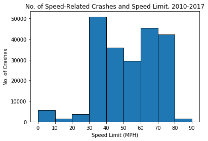

```python
import pandas as pd
import pandas as pd
import matplotlib.pyplot as plt
import numpy as np
import seaborn as sns
import os

```


```python
y2010 = os.path.join("TX 2010 Speed Related Crashes Data.csv")
y2011 = os.path.join("TX 2011 Speed Related Crashes Data.csv")
y2012 = os.path.join("TX 2012 Speed Related Crashes Data.csv")
y2013 = os.path.join("TX 2013 Speed Related Crashes Data.csv")
y2014 = os.path.join("TX 2014 Speed Related Crashes Data.csv")
y2015 = os.path.join("TX 2015 Speed Related Crashes Data.csv")
y2016 = os.path.join("TX 2016 Speed Related Crashes Data.csv")
```


```python
y2010_df = pd.read_csv(y2010, encoding = "ISO-8859-1")
y2011_df = pd.read_csv(y2011, encoding = "ISO-8859-1")
y2012_df = pd.read_csv(y2012, encoding = "ISO-8859-1")
y2013_df = pd.read_csv(y2013, encoding = "ISO-8859-1")
y2014_df = pd.read_csv(y2014, encoding = "ISO-8859-1")
y2015_df = pd.read_csv(y2015, encoding = "ISO-8859-1")
y2016_df = pd.read_csv(y2016, encoding = "ISO-8859-1")
```


```python
y2010_df.head(2)
```


<div>
<style scoped>
    .dataframe tbody tr th:only-of-type {
        vertical-align: middle;
    }

    .dataframe tbody tr th {
        vertical-align: top;
    }

    .dataframe thead th {
        text-align: right;
    }
</style>
<table border="1" class="dataframe">
  <thead>
    <tr style="text-align: right;">
      <th></th>
      <th>Crash ID</th>
      <th>Agency</th>
      <th>City</th>
      <th>County</th>
      <th>Crash Death Count</th>
      <th>Crash Severity</th>
      <th>Crash Time</th>
      <th>Crash Total Injury Count</th>
      <th>Crash Year</th>
      <th>Day of Week</th>
      <th>...</th>
      <th>Manner of Collision</th>
      <th>Population Group</th>
      <th>Road Class</th>
      <th>Speed Limit</th>
      <th>Weather Condition</th>
      <th>Vehicle Color</th>
      <th>Person Age</th>
      <th>Person Ethnicity</th>
      <th>Person Gender</th>
      <th>Person Type</th>
    </tr>
  </thead>
  <tbody>
    <tr>
      <th>0</th>
      <td>11154479</td>
      <td>Paris Police Department</td>
      <td>Paris</td>
      <td>Lamar</td>
      <td>0</td>
      <td>Non-Incapacitating Injury</td>
      <td>1254</td>
      <td>1</td>
      <td>2010</td>
      <td>Friday</td>
      <td>...</td>
      <td>Same Direction - One Straight-One Stopped</td>
      <td>25,000 - 49,999 Pop</td>
      <td>Farm To Market</td>
      <td>30</td>
      <td>Cloudy</td>
      <td>Gray</td>
      <td>28</td>
      <td>Black</td>
      <td>Male</td>
      <td>Driver</td>
    </tr>
    <tr>
      <th>1</th>
      <td>11154479</td>
      <td>Paris Police Department</td>
      <td>Paris</td>
      <td>Lamar</td>
      <td>0</td>
      <td>Non-Incapacitating Injury</td>
      <td>1254</td>
      <td>1</td>
      <td>2010</td>
      <td>Friday</td>
      <td>...</td>
      <td>Same Direction - One Straight-One Stopped</td>
      <td>25,000 - 49,999 Pop</td>
      <td>Farm To Market</td>
      <td>30</td>
      <td>Cloudy</td>
      <td>Red</td>
      <td>17</td>
      <td>Hispanic</td>
      <td>Male</td>
      <td>Driver</td>
    </tr>
  </tbody>
</table>
<p>2 rows × 22 columns</p>
</div>


```python
speedlimit_crash_df = y2010_df.append(y2011_df)
speedlimit_crash_df = speedlimit_crash_df.append(y2012_df)
speedlimit_crash_df = speedlimit_crash_df.append(y2013_df)
speedlimit_crash_df = speedlimit_crash_df.append(y2014_df)
speedlimit_crash_df = speedlimit_crash_df.append(y2015_df)
speedlimit_crash_df = speedlimit_crash_df.append(y2016_df)
speedlimit_crash_df.head(2)
```


<div>
<style scoped>
    .dataframe tbody tr th:only-of-type {
        vertical-align: middle;
    }

    .dataframe tbody tr th {
        vertical-align: top;
    }

    .dataframe thead th {
        text-align: right;
    }
</style>
<table border="1" class="dataframe">
  <thead>
    <tr style="text-align: right;">
      <th></th>
      <th>Crash ID</th>
      <th>Agency</th>
      <th>City</th>
      <th>County</th>
      <th>Crash Death Count</th>
      <th>Crash Severity</th>
      <th>Crash Time</th>
      <th>Crash Total Injury Count</th>
      <th>Crash Year</th>
      <th>Day of Week</th>
      <th>...</th>
      <th>Manner of Collision</th>
      <th>Population Group</th>
      <th>Road Class</th>
      <th>Speed Limit</th>
      <th>Weather Condition</th>
      <th>Vehicle Color</th>
      <th>Person Age</th>
      <th>Person Ethnicity</th>
      <th>Person Gender</th>
      <th>Person Type</th>
    </tr>
  </thead>
  <tbody>
    <tr>
      <th>0</th>
      <td>11154479</td>
      <td>Paris Police Department</td>
      <td>Paris</td>
      <td>Lamar</td>
      <td>0</td>
      <td>Non-Incapacitating Injury</td>
      <td>1254</td>
      <td>1</td>
      <td>2010</td>
      <td>Friday</td>
      <td>...</td>
      <td>Same Direction - One Straight-One Stopped</td>
      <td>25,000 - 49,999 Pop</td>
      <td>Farm To Market</td>
      <td>30</td>
      <td>Cloudy</td>
      <td>Gray</td>
      <td>28</td>
      <td>Black</td>
      <td>Male</td>
      <td>Driver</td>
    </tr>
    <tr>
      <th>1</th>
      <td>11154479</td>
      <td>Paris Police Department</td>
      <td>Paris</td>
      <td>Lamar</td>
      <td>0</td>
      <td>Non-Incapacitating Injury</td>
      <td>1254</td>
      <td>1</td>
      <td>2010</td>
      <td>Friday</td>
      <td>...</td>
      <td>Same Direction - One Straight-One Stopped</td>
      <td>25,000 - 49,999 Pop</td>
      <td>Farm To Market</td>
      <td>30</td>
      <td>Cloudy</td>
      <td>Red</td>
      <td>17</td>
      <td>Hispanic</td>
      <td>Male</td>
      <td>Driver</td>
    </tr>
  </tbody>
</table>
<p>2 rows × 22 columns</p>
</div>


```python
speedlimit_crash_df = speedlimit_crash_df.drop_duplicates(['Crash ID'], keep='first')
speedlimit_crash_df.head(2)
```


<div>
<style scoped>
    .dataframe tbody tr th:only-of-type {
        vertical-align: middle;
    }

    .dataframe tbody tr th {
        vertical-align: top;
    }

    .dataframe thead th {
        text-align: right;
    }
</style>
<table border="1" class="dataframe">
  <thead>
    <tr style="text-align: right;">
      <th></th>
      <th>Crash ID</th>
      <th>Agency</th>
      <th>City</th>
      <th>County</th>
      <th>Crash Death Count</th>
      <th>Crash Severity</th>
      <th>Crash Time</th>
      <th>Crash Total Injury Count</th>
      <th>Crash Year</th>
      <th>Day of Week</th>
      <th>...</th>
      <th>Manner of Collision</th>
      <th>Population Group</th>
      <th>Road Class</th>
      <th>Speed Limit</th>
      <th>Weather Condition</th>
      <th>Vehicle Color</th>
      <th>Person Age</th>
      <th>Person Ethnicity</th>
      <th>Person Gender</th>
      <th>Person Type</th>
    </tr>
  </thead>
  <tbody>
    <tr>
      <th>0</th>
      <td>11154479</td>
      <td>Paris Police Department</td>
      <td>Paris</td>
      <td>Lamar</td>
      <td>0</td>
      <td>Non-Incapacitating Injury</td>
      <td>1254</td>
      <td>1</td>
      <td>2010</td>
      <td>Friday</td>
      <td>...</td>
      <td>Same Direction - One Straight-One Stopped</td>
      <td>25,000 - 49,999 Pop</td>
      <td>Farm To Market</td>
      <td>30</td>
      <td>Cloudy</td>
      <td>Gray</td>
      <td>28</td>
      <td>Black</td>
      <td>Male</td>
      <td>Driver</td>
    </tr>
    <tr>
      <th>2</th>
      <td>11154515</td>
      <td>Department Of Public Safety, State Of Texas</td>
      <td>Rural Wilbarger County</td>
      <td>Wilbarger</td>
      <td>0</td>
      <td>Not Injured</td>
      <td>845</td>
      <td>0</td>
      <td>2010</td>
      <td>Friday</td>
      <td>...</td>
      <td>One Motor Vehicle - Going Straight</td>
      <td>Rural</td>
      <td>US &amp; State Highways</td>
      <td>70</td>
      <td>Cloudy</td>
      <td>White</td>
      <td>33</td>
      <td>White</td>
      <td>Female</td>
      <td>Driver</td>
    </tr>
  </tbody>
</table>
<p>2 rows × 22 columns</p>
</div>


```python
speedlimit_crash_df = speedlimit_crash_df[['Speed Limit','Crash Total Injury Count']]

```


```python
df_sample=speedlimit_crash_df.sample(5000)

```


```python
import seaborn as sns
plt.plot('Speed Limit', 'Crash Total Injury Count', data=speedlimit_crash_df, linestyle='none', marker='o', markersize=0.9, alpha=0.05)
plt.title("Speed Limit and Speed-Related Crash Injury Count, 2010-2016")
plt.ylabel("Total Injuries per Crash")
plt.xlabel("Speed Limit (MPH)")
plt.ylim((0,15))
plt.xlim((5,85))

plt.show()
```


### Speed Limit and Crash Injury Count
#### * Uses a sample size of 5000
#### * The greatest number of crashes and injuries occured between 30 and 75 MPH.
#### * Most speed-related crashes have less than one injury per crash.
#### * The highest rate of injuries per crash occurs at speed limits between 30 and 75 miles per hour.
#### * Total injuries per crash are almost twice as high at speed limits greater than 30 MPH.


```python
speedlimit_grouped = pd.DataFrame(speedlimit_crash_df.groupby(["Speed Limit"]).count()["Crash Total Injury Count"])
speedlimit_grouped=speedlimit_grouped.reset_index()
speedlimit_grouped.head()
```


<div>
<style scoped>
    .dataframe tbody tr th:only-of-type {
        vertical-align: middle;
    }

    .dataframe tbody tr th {
        vertical-align: top;
    }

    .dataframe thead th {
        text-align: right;
    }
</style>
<table border="1" class="dataframe">
  <thead>
    <tr style="text-align: right;">
      <th></th>
      <th>Speed Limit</th>
      <th>Crash Total Injury Count</th>
    </tr>
  </thead>
  <tbody>
    <tr>
      <th>0</th>
      <td>-1</td>
      <td>3099</td>
    </tr>
    <tr>
      <th>1</th>
      <td>0</td>
      <td>4936</td>
    </tr>
    <tr>
      <th>2</th>
      <td>5</td>
      <td>456</td>
    </tr>
    <tr>
      <th>3</th>
      <td>6</td>
      <td>3</td>
    </tr>
    <tr>
      <th>4</th>
      <td>8</td>
      <td>1</td>
    </tr>
  </tbody>
</table>
</div>


```python
plt.plot('Speed Limit', 'Crash Total Injury Count', data=speedlimit_grouped, linestyle='none', marker='o')
plt.title("No. of Crashes and Speed Limit, 2010-2016")
plt.ylabel("No. of Crashes")
plt.xlabel("Speed Limit (MPH)")
plt.ylim((1,30000))
plt.xlim((5,85))

plt.show()
```


```python
plt.bar('Speed Limit', 'Crash Total Injury Count', data=speedlimit_grouped)
plt.title("No. of Crashes and Speed Limit")
plt.ylabel("No. of Crashes")
plt.xlabel("Speed Limit")
plt.ylim((1,30000))
plt.xlim((5,85))

plt.show()
```


```python
bins= [0,10,20,30,40,50,60,70,80,90]
plt.hist(speedlimit_crash_df["Speed Limit"], bins = bins, edgecolor="k")
plt.xticks(bins)
plt.title("No. of Speed-Related Crashes and Speed Limit, 2010-2016")
plt.ylabel("No. of Crashes")
plt.xlabel("Speed Limit (MPH)")

plt.show()
```





### No. of Crashes and Speed Limit
#### * The majority of crashes occurred between 30 and 79 MPH speed limits with the greatest amount in the 30-39 MPH speed limits.
#### * Speeding in 30-39 MPH speed zones caused the most crashes
