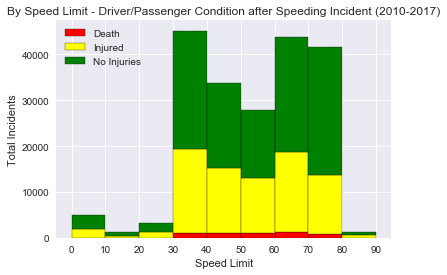

```python
import pandas as pd
import pandas as pd
import matplotlib.pyplot as plt
import numpy as np
import seaborn as sns
import os

```


```python
y2010 = os.path.join("Texas Speed Related Incidents Data Set","TX 2010 Speed Related Crashes Data.csv")
y2011 = os.path.join("Texas Speed Related Incidents Data Set","TX 2011 Speed Related Crashes Data.csv")
y2012 = os.path.join("Texas Speed Related Incidents Data Set","TX 2012 Speed Related Crashes Data.csv")
y2013 = os.path.join("Texas Speed Related Incidents Data Set","TX 2013 Speed Related Crashes Data.csv")
y2014 = os.path.join("Texas Speed Related Incidents Data Set","TX 2014 Speed Related Crashes Data.csv")
y2015 = os.path.join("Texas Speed Related Incidents Data Set","TX 2015 Speed Related Crashes Data.csv")
y2016 = os.path.join("Texas Speed Related Incidents Data Set","TX 2016 Speed Related Crashes Data.csv")
y2017 = os.path.join("Texas Speed Related Incidents Data Set","TX 2017 Speed Related Crashes Data.csv")
```


```python
y2010_df = pd.read_csv(y2010, encoding = "ISO-8859-1")
y2011_df = pd.read_csv(y2011, encoding = "ISO-8859-1")
y2012_df = pd.read_csv(y2012, encoding = "ISO-8859-1")
y2013_df = pd.read_csv(y2013, encoding = "ISO-8859-1")
y2014_df = pd.read_csv(y2014, encoding = "ISO-8859-1")
y2015_df = pd.read_csv(y2015, encoding = "ISO-8859-1")
y2016_df = pd.read_csv(y2016, encoding = "ISO-8859-1")
y2017_df = pd.read_csv(y2017, encoding = "ISO-8859-1")
```


```python
y2010_df.head(2)
```


<div>
<style scoped>
    .dataframe tbody tr th:only-of-type {
        vertical-align: middle;
    }

    .dataframe tbody tr th {
        vertical-align: top;
    }

    .dataframe thead th {
        text-align: right;
    }
</style>
<table border="1" class="dataframe">
  <thead>
    <tr style="text-align: right;">
      <th></th>
      <th>Crash ID</th>
      <th>Agency</th>
      <th>City</th>
      <th>County</th>
      <th>Crash Death Count</th>
      <th>Crash Severity</th>
      <th>Crash Time</th>
      <th>Crash Total Injury Count</th>
      <th>Crash Year</th>
      <th>Day of Week</th>
      <th>...</th>
      <th>Manner of Collision</th>
      <th>Population Group</th>
      <th>Road Class</th>
      <th>Speed Limit</th>
      <th>Weather Condition</th>
      <th>Vehicle Color</th>
      <th>Person Age</th>
      <th>Person Ethnicity</th>
      <th>Person Gender</th>
      <th>Person Type</th>
    </tr>
  </thead>
  <tbody>
    <tr>
      <th>0</th>
      <td>11154479</td>
      <td>Paris Police Department</td>
      <td>Paris</td>
      <td>Lamar</td>
      <td>0</td>
      <td>Non-Incapacitating Injury</td>
      <td>1254</td>
      <td>1</td>
      <td>2010</td>
      <td>Friday</td>
      <td>...</td>
      <td>Same Direction - One Straight-One Stopped</td>
      <td>25,000 - 49,999 Pop</td>
      <td>Farm To Market</td>
      <td>30</td>
      <td>Cloudy</td>
      <td>Gray</td>
      <td>28</td>
      <td>Black</td>
      <td>Male</td>
      <td>Driver</td>
    </tr>
    <tr>
      <th>1</th>
      <td>11154479</td>
      <td>Paris Police Department</td>
      <td>Paris</td>
      <td>Lamar</td>
      <td>0</td>
      <td>Non-Incapacitating Injury</td>
      <td>1254</td>
      <td>1</td>
      <td>2010</td>
      <td>Friday</td>
      <td>...</td>
      <td>Same Direction - One Straight-One Stopped</td>
      <td>25,000 - 49,999 Pop</td>
      <td>Farm To Market</td>
      <td>30</td>
      <td>Cloudy</td>
      <td>Red</td>
      <td>17</td>
      <td>Hispanic</td>
      <td>Male</td>
      <td>Driver</td>
    </tr>
  </tbody>
</table>
<p>2 rows × 22 columns</p>
</div>


```python
speedlimit_crash_df = y2010_df.append(y2011_df)
speedlimit_crash_df = speedlimit_crash_df.append(y2012_df)
speedlimit_crash_df = speedlimit_crash_df.append(y2013_df)
speedlimit_crash_df = speedlimit_crash_df.append(y2014_df)
speedlimit_crash_df = speedlimit_crash_df.append(y2015_df)
speedlimit_crash_df = speedlimit_crash_df.append(y2016_df)
speedlimit_crash_df = speedlimit_crash_df.append(y2017_df)
speedlimit_crash_df.head(2)
```


<div>
<style scoped>
    .dataframe tbody tr th:only-of-type {
        vertical-align: middle;
    }

    .dataframe tbody tr th {
        vertical-align: top;
    }

    .dataframe thead th {
        text-align: right;
    }
</style>
<table border="1" class="dataframe">
  <thead>
    <tr style="text-align: right;">
      <th></th>
      <th>Crash ID</th>
      <th>Agency</th>
      <th>City</th>
      <th>County</th>
      <th>Crash Death Count</th>
      <th>Crash Severity</th>
      <th>Crash Time</th>
      <th>Crash Total Injury Count</th>
      <th>Crash Year</th>
      <th>Day of Week</th>
      <th>...</th>
      <th>Manner of Collision</th>
      <th>Population Group</th>
      <th>Road Class</th>
      <th>Speed Limit</th>
      <th>Weather Condition</th>
      <th>Vehicle Color</th>
      <th>Person Age</th>
      <th>Person Ethnicity</th>
      <th>Person Gender</th>
      <th>Person Type</th>
    </tr>
  </thead>
  <tbody>
    <tr>
      <th>0</th>
      <td>11154479</td>
      <td>Paris Police Department</td>
      <td>Paris</td>
      <td>Lamar</td>
      <td>0</td>
      <td>Non-Incapacitating Injury</td>
      <td>1254</td>
      <td>1</td>
      <td>2010</td>
      <td>Friday</td>
      <td>...</td>
      <td>Same Direction - One Straight-One Stopped</td>
      <td>25,000 - 49,999 Pop</td>
      <td>Farm To Market</td>
      <td>30</td>
      <td>Cloudy</td>
      <td>Gray</td>
      <td>28</td>
      <td>Black</td>
      <td>Male</td>
      <td>Driver</td>
    </tr>
    <tr>
      <th>1</th>
      <td>11154479</td>
      <td>Paris Police Department</td>
      <td>Paris</td>
      <td>Lamar</td>
      <td>0</td>
      <td>Non-Incapacitating Injury</td>
      <td>1254</td>
      <td>1</td>
      <td>2010</td>
      <td>Friday</td>
      <td>...</td>
      <td>Same Direction - One Straight-One Stopped</td>
      <td>25,000 - 49,999 Pop</td>
      <td>Farm To Market</td>
      <td>30</td>
      <td>Cloudy</td>
      <td>Red</td>
      <td>17</td>
      <td>Hispanic</td>
      <td>Male</td>
      <td>Driver</td>
    </tr>
  </tbody>
</table>
<p>2 rows × 22 columns</p>
</div>


```python
speedlimit_crash_df = speedlimit_crash_df.drop_duplicates(['Crash ID'], keep='first')
speedlimit_crash_df.head(2)
```


<div>
<style scoped>
    .dataframe tbody tr th:only-of-type {
        vertical-align: middle;
    }

    .dataframe tbody tr th {
        vertical-align: top;
    }

    .dataframe thead th {
        text-align: right;
    }
</style>
<table border="1" class="dataframe">
  <thead>
    <tr style="text-align: right;">
      <th></th>
      <th>Crash ID</th>
      <th>Agency</th>
      <th>City</th>
      <th>County</th>
      <th>Crash Death Count</th>
      <th>Crash Severity</th>
      <th>Crash Time</th>
      <th>Crash Total Injury Count</th>
      <th>Crash Year</th>
      <th>Day of Week</th>
      <th>...</th>
      <th>Manner of Collision</th>
      <th>Population Group</th>
      <th>Road Class</th>
      <th>Speed Limit</th>
      <th>Weather Condition</th>
      <th>Vehicle Color</th>
      <th>Person Age</th>
      <th>Person Ethnicity</th>
      <th>Person Gender</th>
      <th>Person Type</th>
    </tr>
  </thead>
  <tbody>
    <tr>
      <th>0</th>
      <td>11154479</td>
      <td>Paris Police Department</td>
      <td>Paris</td>
      <td>Lamar</td>
      <td>0</td>
      <td>Non-Incapacitating Injury</td>
      <td>1254</td>
      <td>1</td>
      <td>2010</td>
      <td>Friday</td>
      <td>...</td>
      <td>Same Direction - One Straight-One Stopped</td>
      <td>25,000 - 49,999 Pop</td>
      <td>Farm To Market</td>
      <td>30</td>
      <td>Cloudy</td>
      <td>Gray</td>
      <td>28</td>
      <td>Black</td>
      <td>Male</td>
      <td>Driver</td>
    </tr>
    <tr>
      <th>2</th>
      <td>11154515</td>
      <td>Department Of Public Safety, State Of Texas</td>
      <td>Rural Wilbarger County</td>
      <td>Wilbarger</td>
      <td>0</td>
      <td>Not Injured</td>
      <td>845</td>
      <td>0</td>
      <td>2010</td>
      <td>Friday</td>
      <td>...</td>
      <td>One Motor Vehicle - Going Straight</td>
      <td>Rural</td>
      <td>US &amp; State Highways</td>
      <td>70</td>
      <td>Cloudy</td>
      <td>White</td>
      <td>33</td>
      <td>White</td>
      <td>Female</td>
      <td>Driver</td>
    </tr>
  </tbody>
</table>
<p>2 rows × 22 columns</p>
</div>


```python
speedlimit_crash_df = speedlimit_crash_df[['Speed Limit','Crash Total Injury Count']]

```


```python
df_sample=speedlimit_crash_df.sample(5000)

```


```python
import seaborn as sns
plt.plot('Speed Limit', 'Crash Total Injury Count', data=speedlimit_crash_df, linestyle='none', marker='o', markersize=0.9, alpha=0.05)
plt.title("Speed Limit and Speed-Related Crash Injury Count, 2010-2017")
plt.ylabel("Total Injuries per Crash")
plt.xlabel("Speed Limit (MPH)")
plt.ylim((0,15))
plt.xlim((5,85))

plt.show()
```


### Speed Limit and Crash Injury Count
#### * The greatest number of crashes and injuries occured between 30 and 75 MPH.
#### * Most speed-related crashes have less than one injury per crash.
#### * The highest rate of injuries per crash occurs at speed limits between 30 and 75 miles per hour.
#### * Total injuries per crash are almost twice as high at speed limits greater than 30 MPH.


```python
speedlimit_grouped = pd.DataFrame(speedlimit_crash_df.groupby(["Speed Limit"]).count()["Crash Total Injury Count"])
speedlimit_grouped=speedlimit_grouped.reset_index()
speedlimit_grouped.head()
```


<div>
<style scoped>
    .dataframe tbody tr th:only-of-type {
        vertical-align: middle;
    }

    .dataframe tbody tr th {
        vertical-align: top;
    }

    .dataframe thead th {
        text-align: right;
    }
</style>
<table border="1" class="dataframe">
  <thead>
    <tr style="text-align: right;">
      <th></th>
      <th>Speed Limit</th>
      <th>Crash Total Injury Count</th>
    </tr>
  </thead>
  <tbody>
    <tr>
      <th>0</th>
      <td>-1</td>
      <td>4018</td>
    </tr>
    <tr>
      <th>1</th>
      <td>0</td>
      <td>4936</td>
    </tr>
    <tr>
      <th>2</th>
      <td>5</td>
      <td>553</td>
    </tr>
    <tr>
      <th>3</th>
      <td>6</td>
      <td>3</td>
    </tr>
    <tr>
      <th>4</th>
      <td>8</td>
      <td>1</td>
    </tr>
  </tbody>
</table>
</div>


```python
plt.plot('Speed Limit', 'Crash Total Injury Count', data=speedlimit_grouped, linestyle='none', marker='o')
plt.title("No. of Crashes and Speed Limit, 2010-2017")
plt.ylabel("No. of Crashes")
plt.xlabel("Speed Limit (MPH)")
plt.ylim((1,30000))
plt.xlim((5,85))

plt.show()
```


```python
plt.bar('Speed Limit', 'Crash Total Injury Count', data=speedlimit_grouped)
plt.title("No. of Crashes and Speed Limit")
plt.ylabel("No. of Crashes")
plt.xlabel("Speed Limit")
plt.ylim((1,30000))
plt.xlim((5,85))

plt.show()
```


```python
bins= [0,10,20,30,40,50,60,70,80,90]
plt.hist(speedlimit_crash_df["Speed Limit"], bins = bins, edgecolor="k")
plt.xticks(bins)
plt.title("No. of Speed-Related Crashes and Speed Limit, 2010-2017")
plt.ylabel("No. of Crashes")
plt.xlabel("Speed Limit (MPH)")

plt.show()
```


### No. of Crashes and Speed Limit
#### * The majority of crashes occurred between 30 and 79 MPH speed limits with the greatest amount in the 30-39 MPH speed limits.
#### * Speeding in 30-39 MPH speed zones caused the most crashes


```python
speedlimit_injury_df = y2010_df.append(y2011_df)
speedlimit_injury_df = speedlimit_injury_df.append(y2012_df)
speedlimit_injury_df = speedlimit_injury_df.append(y2013_df)
speedlimit_injury_df = speedlimit_injury_df.append(y2014_df)
speedlimit_injury_df = speedlimit_injury_df.append(y2015_df)
speedlimit_injury_df = speedlimit_injury_df.append(y2016_df)
speedlimit_injury_df = speedlimit_injury_df.append(y2017_df)
speedlimit_injury_df = speedlimit_injury_df.drop_duplicates(['Crash ID'], keep='first')
speedlimit_injury_df.head(50)
```


<div>
<style scoped>
    .dataframe tbody tr th:only-of-type {
        vertical-align: middle;
    }

    .dataframe tbody tr th {
        vertical-align: top;
    }

    .dataframe thead th {
        text-align: right;
    }
</style>
<table border="1" class="dataframe">
  <thead>
    <tr style="text-align: right;">
      <th></th>
      <th>Crash ID</th>
      <th>Agency</th>
      <th>City</th>
      <th>County</th>
      <th>Crash Death Count</th>
      <th>Crash Severity</th>
      <th>Crash Time</th>
      <th>Crash Total Injury Count</th>
      <th>Crash Year</th>
      <th>Day of Week</th>
      <th>...</th>
      <th>Manner of Collision</th>
      <th>Population Group</th>
      <th>Road Class</th>
      <th>Speed Limit</th>
      <th>Weather Condition</th>
      <th>Vehicle Color</th>
      <th>Person Age</th>
      <th>Person Ethnicity</th>
      <th>Person Gender</th>
      <th>Person Type</th>
    </tr>
  </thead>
  <tbody>
    <tr>
      <th>0</th>
      <td>11154479</td>
      <td>Paris Police Department</td>
      <td>Paris</td>
      <td>Lamar</td>
      <td>0</td>
      <td>Non-Incapacitating Injury</td>
      <td>1254</td>
      <td>1</td>
      <td>2010</td>
      <td>Friday</td>
      <td>...</td>
      <td>Same Direction - One Straight-One Stopped</td>
      <td>25,000 - 49,999 Pop</td>
      <td>Farm To Market</td>
      <td>30</td>
      <td>Cloudy</td>
      <td>Gray</td>
      <td>28</td>
      <td>Black</td>
      <td>Male</td>
      <td>Driver</td>
    </tr>
    <tr>
      <th>2</th>
      <td>11154515</td>
      <td>Department Of Public Safety, State Of Texas</td>
      <td>Rural Wilbarger County</td>
      <td>Wilbarger</td>
      <td>0</td>
      <td>Not Injured</td>
      <td>845</td>
      <td>0</td>
      <td>2010</td>
      <td>Friday</td>
      <td>...</td>
      <td>One Motor Vehicle - Going Straight</td>
      <td>Rural</td>
      <td>US &amp; State Highways</td>
      <td>70</td>
      <td>Cloudy</td>
      <td>White</td>
      <td>33</td>
      <td>White</td>
      <td>Female</td>
      <td>Driver</td>
    </tr>
    <tr>
      <th>5</th>
      <td>11155308</td>
      <td>Laredo Police Department</td>
      <td>Laredo</td>
      <td>Webb</td>
      <td>0</td>
      <td>Non-Incapacitating Injury</td>
      <td>810</td>
      <td>1</td>
      <td>2010</td>
      <td>Friday</td>
      <td>...</td>
      <td>Angle - Both Going Straight</td>
      <td>100,000 - 249,999 Pop</td>
      <td>City Street</td>
      <td>30</td>
      <td>Clear</td>
      <td>Red</td>
      <td>72</td>
      <td>Hispanic</td>
      <td>Female</td>
      <td>Driver</td>
    </tr>
    <tr>
      <th>7</th>
      <td>11156832</td>
      <td>Department Of Public Safety, State Of Texas</td>
      <td>Rural Palo Pinto County</td>
      <td>Palo Pinto</td>
      <td>0</td>
      <td>Non-Incapacitating Injury</td>
      <td>1635</td>
      <td>1</td>
      <td>2010</td>
      <td>Friday</td>
      <td>...</td>
      <td>One Motor Vehicle - Going Straight</td>
      <td>Rural</td>
      <td>Farm To Market</td>
      <td>60</td>
      <td>Clear</td>
      <td>Red</td>
      <td>48</td>
      <td>White</td>
      <td>Male</td>
      <td>Driver Of Motorcycle Type Vehicle</td>
    </tr>
    <tr>
      <th>8</th>
      <td>11156835</td>
      <td>Department Of Public Safety, State Of Texas</td>
      <td>Rural Parker County</td>
      <td>Parker</td>
      <td>0</td>
      <td>Not Injured</td>
      <td>130</td>
      <td>0</td>
      <td>2010</td>
      <td>Friday</td>
      <td>...</td>
      <td>One Motor Vehicle - Going Straight</td>
      <td>Rural</td>
      <td>County Road</td>
      <td>0</td>
      <td>Clear</td>
      <td>Gray</td>
      <td>54</td>
      <td>White</td>
      <td>Male</td>
      <td>Driver</td>
    </tr>
    <tr>
      <th>9</th>
      <td>11157938</td>
      <td>Fort Worth Police Department</td>
      <td>Fort Worth</td>
      <td>Tarrant</td>
      <td>0</td>
      <td>Not Injured</td>
      <td>610</td>
      <td>0</td>
      <td>2010</td>
      <td>Friday</td>
      <td>...</td>
      <td>One Motor Vehicle - Going Straight</td>
      <td>250,000 Pop And Over</td>
      <td>US &amp; State Highways</td>
      <td>40</td>
      <td>Clear</td>
      <td>Silver</td>
      <td>29</td>
      <td>White</td>
      <td>Male</td>
      <td>Driver</td>
    </tr>
    <tr>
      <th>10</th>
      <td>11158122</td>
      <td>Department Of Public Safety, State Of Texas</td>
      <td>Rural Tyler County</td>
      <td>Tyler</td>
      <td>0</td>
      <td>Not Injured</td>
      <td>1410</td>
      <td>0</td>
      <td>2010</td>
      <td>Friday</td>
      <td>...</td>
      <td>One Motor Vehicle - Going Straight</td>
      <td>Rural</td>
      <td>County Road</td>
      <td>30</td>
      <td>Clear</td>
      <td>Blue</td>
      <td>28</td>
      <td>White</td>
      <td>Male</td>
      <td>Driver</td>
    </tr>
    <tr>
      <th>13</th>
      <td>11158273</td>
      <td>Mesquite Police Department</td>
      <td>Mesquite</td>
      <td>Dallas</td>
      <td>0</td>
      <td>Not Injured</td>
      <td>450</td>
      <td>0</td>
      <td>2010</td>
      <td>Friday</td>
      <td>...</td>
      <td>One Motor Vehicle - Going Straight</td>
      <td>100,000 - 249,999 Pop</td>
      <td>Interstate</td>
      <td>45</td>
      <td>Cloudy</td>
      <td>Black</td>
      <td>20</td>
      <td>Black</td>
      <td>Male</td>
      <td>Driver</td>
    </tr>
    <tr>
      <th>14</th>
      <td>11158274</td>
      <td>Mesquite Police Department</td>
      <td>Mesquite</td>
      <td>Dallas</td>
      <td>0</td>
      <td>Not Injured</td>
      <td>2300</td>
      <td>0</td>
      <td>2010</td>
      <td>Friday</td>
      <td>...</td>
      <td>One Motor Vehicle - Going Straight</td>
      <td>100,000 - 249,999 Pop</td>
      <td>Non Trafficway</td>
      <td>0</td>
      <td>Clear</td>
      <td>Silver</td>
      <td>17</td>
      <td>White</td>
      <td>Male</td>
      <td>Driver</td>
    </tr>
    <tr>
      <th>15</th>
      <td>11159558</td>
      <td>Department Of Public Safety, State Of Texas</td>
      <td>Rural McLennan County</td>
      <td>McLennan</td>
      <td>0</td>
      <td>Not Injured</td>
      <td>450</td>
      <td>0</td>
      <td>2010</td>
      <td>Friday</td>
      <td>...</td>
      <td>One Motor Vehicle - Turning Right</td>
      <td>Rural</td>
      <td>County Road</td>
      <td>40</td>
      <td>Clear</td>
      <td>Maroon</td>
      <td>18</td>
      <td>Hispanic</td>
      <td>Male</td>
      <td>Driver</td>
    </tr>
    <tr>
      <th>16</th>
      <td>11159746</td>
      <td>Department Of Public Safety, State Of Texas</td>
      <td>Rural Montgomery County</td>
      <td>Montgomery</td>
      <td>0</td>
      <td>Not Injured</td>
      <td>530</td>
      <td>0</td>
      <td>2010</td>
      <td>Friday</td>
      <td>...</td>
      <td>One Motor Vehicle - Going Straight</td>
      <td>Rural</td>
      <td>Farm To Market</td>
      <td>50</td>
      <td>Clear</td>
      <td>Green</td>
      <td>26</td>
      <td>White</td>
      <td>Female</td>
      <td>Driver</td>
    </tr>
    <tr>
      <th>18</th>
      <td>11162768</td>
      <td>Irving Police Department</td>
      <td>Irving</td>
      <td>Dallas</td>
      <td>0</td>
      <td>Possible Injury</td>
      <td>502</td>
      <td>1</td>
      <td>2010</td>
      <td>Friday</td>
      <td>...</td>
      <td>Angle - Both Going Straight</td>
      <td>100,000 - 249,999 Pop</td>
      <td>City Street</td>
      <td>30</td>
      <td>Clear</td>
      <td>Gold</td>
      <td>25</td>
      <td>Hispanic</td>
      <td>Male</td>
      <td>Driver</td>
    </tr>
    <tr>
      <th>23</th>
      <td>11163435</td>
      <td>Department Of Public Safety, State Of Texas</td>
      <td>Rural Bell County</td>
      <td>Bell</td>
      <td>0</td>
      <td>Possible Injury</td>
      <td>330</td>
      <td>1</td>
      <td>2010</td>
      <td>Friday</td>
      <td>...</td>
      <td>One Motor Vehicle - Going Straight</td>
      <td>Rural</td>
      <td>County Road</td>
      <td>45</td>
      <td>Clear</td>
      <td>Green</td>
      <td>36</td>
      <td>White</td>
      <td>Male</td>
      <td>Driver</td>
    </tr>
    <tr>
      <th>24</th>
      <td>11163450</td>
      <td>Department Of Public Safety, State Of Texas</td>
      <td>Rural Victoria County</td>
      <td>Victoria</td>
      <td>0</td>
      <td>Possible Injury</td>
      <td>2317</td>
      <td>2</td>
      <td>2010</td>
      <td>Friday</td>
      <td>...</td>
      <td>One Motor Vehicle - Going Straight</td>
      <td>Rural</td>
      <td>US &amp; State Highways</td>
      <td>65</td>
      <td>Clear</td>
      <td>Green</td>
      <td>No Data</td>
      <td>Unknown</td>
      <td>Unknown</td>
      <td>Driver</td>
    </tr>
    <tr>
      <th>27</th>
      <td>11163474</td>
      <td>Department Of Public Safety, State Of Texas</td>
      <td>Rural Fayette County</td>
      <td>Fayette</td>
      <td>0</td>
      <td>Not Injured</td>
      <td>400</td>
      <td>0</td>
      <td>2010</td>
      <td>Friday</td>
      <td>...</td>
      <td>One Motor Vehicle - Going Straight</td>
      <td>Rural</td>
      <td>County Road</td>
      <td>55</td>
      <td>Clear</td>
      <td>White</td>
      <td>22</td>
      <td>Hispanic</td>
      <td>Male</td>
      <td>Driver</td>
    </tr>
    <tr>
      <th>28</th>
      <td>11163475</td>
      <td>Department Of Public Safety, State Of Texas</td>
      <td>Rural Fayette County</td>
      <td>Fayette</td>
      <td>0</td>
      <td>Not Injured</td>
      <td>300</td>
      <td>0</td>
      <td>2010</td>
      <td>Friday</td>
      <td>...</td>
      <td>One Motor Vehicle - Going Straight</td>
      <td>Rural</td>
      <td>County Road</td>
      <td>30</td>
      <td>Clear</td>
      <td>White</td>
      <td>48</td>
      <td>White</td>
      <td>Male</td>
      <td>Driver</td>
    </tr>
    <tr>
      <th>30</th>
      <td>11164302</td>
      <td>Department Of Public Safety, State Of Texas</td>
      <td>Rural Van Zandt County</td>
      <td>Van Zandt</td>
      <td>0</td>
      <td>Not Injured</td>
      <td>1340</td>
      <td>0</td>
      <td>2010</td>
      <td>Friday</td>
      <td>...</td>
      <td>One Motor Vehicle - Going Straight</td>
      <td>Rural</td>
      <td>Farm To Market</td>
      <td>55</td>
      <td>Cloudy</td>
      <td>Silver</td>
      <td>30</td>
      <td>White</td>
      <td>Male</td>
      <td>Driver</td>
    </tr>
    <tr>
      <th>31</th>
      <td>11165129</td>
      <td>Department Of Public Safety, State Of Texas</td>
      <td>Austin</td>
      <td>Travis</td>
      <td>0</td>
      <td>Not Injured</td>
      <td>117</td>
      <td>0</td>
      <td>2010</td>
      <td>Friday</td>
      <td>...</td>
      <td>One Motor Vehicle - Turning Left</td>
      <td>250,000 Pop And Over</td>
      <td>City Street</td>
      <td>30</td>
      <td>Clear</td>
      <td>Green</td>
      <td>19</td>
      <td>Hispanic</td>
      <td>Male</td>
      <td>Driver</td>
    </tr>
    <tr>
      <th>32</th>
      <td>11166372</td>
      <td>Dallas County Sheriff's Office</td>
      <td>Dallas</td>
      <td>Dallas</td>
      <td>0</td>
      <td>Possible Injury</td>
      <td>445</td>
      <td>1</td>
      <td>2010</td>
      <td>Friday</td>
      <td>...</td>
      <td>One Motor Vehicle - Going Straight</td>
      <td>250,000 Pop And Over</td>
      <td>Interstate</td>
      <td>60</td>
      <td>Clear</td>
      <td>Green</td>
      <td>44</td>
      <td>Hispanic</td>
      <td>Female</td>
      <td>Driver</td>
    </tr>
    <tr>
      <th>33</th>
      <td>11168929</td>
      <td>Department Of Public Safety, State Of Texas</td>
      <td>Rural Hidalgo County</td>
      <td>Hidalgo</td>
      <td>0</td>
      <td>Not Injured</td>
      <td>530</td>
      <td>0</td>
      <td>2010</td>
      <td>Friday</td>
      <td>...</td>
      <td>One Motor Vehicle - Going Straight</td>
      <td>Rural</td>
      <td>County Road</td>
      <td>30</td>
      <td>Clear</td>
      <td>Gold</td>
      <td>30</td>
      <td>Hispanic</td>
      <td>Male</td>
      <td>Driver</td>
    </tr>
    <tr>
      <th>34</th>
      <td>11169007</td>
      <td>Department Of Public Safety, State Of Texas</td>
      <td>Rural Anderson County</td>
      <td>Anderson</td>
      <td>0</td>
      <td>Not Injured</td>
      <td>250</td>
      <td>0</td>
      <td>2010</td>
      <td>Friday</td>
      <td>...</td>
      <td>One Motor Vehicle - Turning Left</td>
      <td>Rural</td>
      <td>County Road</td>
      <td>60</td>
      <td>Cloudy</td>
      <td>White</td>
      <td>21</td>
      <td>White</td>
      <td>Male</td>
      <td>Driver</td>
    </tr>
    <tr>
      <th>35</th>
      <td>11170520</td>
      <td>Department Of Public Safety, State Of Texas</td>
      <td>Rural Smith County</td>
      <td>Smith</td>
      <td>0</td>
      <td>Incapacitating Injury</td>
      <td>640</td>
      <td>1</td>
      <td>2010</td>
      <td>Friday</td>
      <td>...</td>
      <td>One Motor Vehicle - Going Straight</td>
      <td>Rural</td>
      <td>Interstate</td>
      <td>70</td>
      <td>Clear</td>
      <td>White</td>
      <td>27</td>
      <td>Hispanic</td>
      <td>Male</td>
      <td>Driver</td>
    </tr>
    <tr>
      <th>36</th>
      <td>11170937</td>
      <td>Department Of Public Safety, State Of Texas</td>
      <td>Rural Hays County</td>
      <td>Hays</td>
      <td>0</td>
      <td>Possible Injury</td>
      <td>200</td>
      <td>1</td>
      <td>2010</td>
      <td>Friday</td>
      <td>...</td>
      <td>One Motor Vehicle - Turning Left</td>
      <td>Rural</td>
      <td>Farm To Market</td>
      <td>55</td>
      <td>Clear</td>
      <td>Black</td>
      <td>19</td>
      <td>White</td>
      <td>Male</td>
      <td>Driver</td>
    </tr>
    <tr>
      <th>37</th>
      <td>11171745</td>
      <td>Department Of Public Safety, State Of Texas</td>
      <td>Rural Fort Bend County</td>
      <td>Fort Bend</td>
      <td>0</td>
      <td>Non-Incapacitating Injury</td>
      <td>658</td>
      <td>1</td>
      <td>2010</td>
      <td>Friday</td>
      <td>...</td>
      <td>One Motor Vehicle - Going Straight</td>
      <td>Rural</td>
      <td>US &amp; State Highways</td>
      <td>55</td>
      <td>Cloudy</td>
      <td>Tan</td>
      <td>21</td>
      <td>White</td>
      <td>Male</td>
      <td>Driver</td>
    </tr>
    <tr>
      <th>38</th>
      <td>11173396</td>
      <td>Department Of Public Safety, State Of Texas</td>
      <td>Rural Montgomery County</td>
      <td>Montgomery</td>
      <td>0</td>
      <td>Incapacitating Injury</td>
      <td>2320</td>
      <td>1</td>
      <td>2010</td>
      <td>Friday</td>
      <td>...</td>
      <td>One Motor Vehicle - Going Straight</td>
      <td>Rural</td>
      <td>County Road</td>
      <td>30</td>
      <td>Cloudy</td>
      <td>White</td>
      <td>38</td>
      <td>White</td>
      <td>Female</td>
      <td>Driver</td>
    </tr>
    <tr>
      <th>39</th>
      <td>11174000</td>
      <td>The Colony Police Department</td>
      <td>The Colony</td>
      <td>Denton</td>
      <td>0</td>
      <td>Not Injured</td>
      <td>231</td>
      <td>0</td>
      <td>2010</td>
      <td>Friday</td>
      <td>...</td>
      <td>One Motor Vehicle - Going Straight</td>
      <td>25,000 - 49,999 Pop</td>
      <td>City Street</td>
      <td>30</td>
      <td>Cloudy</td>
      <td>Tan</td>
      <td>20</td>
      <td>White</td>
      <td>Male</td>
      <td>Driver</td>
    </tr>
    <tr>
      <th>40</th>
      <td>11174376</td>
      <td>Department Of Public Safety, State Of Texas</td>
      <td>Rural Guadalupe County</td>
      <td>Guadalupe</td>
      <td>0</td>
      <td>Not Injured</td>
      <td>2128</td>
      <td>0</td>
      <td>2010</td>
      <td>Friday</td>
      <td>...</td>
      <td>One Motor Vehicle - Going Straight</td>
      <td>Rural</td>
      <td>City Street</td>
      <td>35</td>
      <td>Clear</td>
      <td>Blue</td>
      <td>23</td>
      <td>Hispanic</td>
      <td>Female</td>
      <td>Driver</td>
    </tr>
    <tr>
      <th>44</th>
      <td>11174930</td>
      <td>College Station Police Department</td>
      <td>College Station</td>
      <td>Brazos</td>
      <td>0</td>
      <td>Non-Incapacitating Injury</td>
      <td>1440</td>
      <td>1</td>
      <td>2010</td>
      <td>Friday</td>
      <td>...</td>
      <td>One Motor Vehicle - Going Straight</td>
      <td>50,000 - 99,999 Pop</td>
      <td>City Street</td>
      <td>55</td>
      <td>Clear</td>
      <td>Red</td>
      <td>18</td>
      <td>White</td>
      <td>Male</td>
      <td>Driver</td>
    </tr>
    <tr>
      <th>45</th>
      <td>11176456</td>
      <td>Department Of Public Safety, State Of Texas</td>
      <td>Rural Montgomery County</td>
      <td>Montgomery</td>
      <td>0</td>
      <td>Possible Injury</td>
      <td>202</td>
      <td>2</td>
      <td>2010</td>
      <td>Friday</td>
      <td>...</td>
      <td>One Motor Vehicle - Going Straight</td>
      <td>Rural</td>
      <td>Interstate</td>
      <td>55</td>
      <td>Clear</td>
      <td>Black</td>
      <td>30</td>
      <td>White</td>
      <td>Female</td>
      <td>Driver</td>
    </tr>
    <tr>
      <th>47</th>
      <td>11176887</td>
      <td>Department Of Public Safety, State Of Texas</td>
      <td>Rural Smith County</td>
      <td>Smith</td>
      <td>0</td>
      <td>Not Injured</td>
      <td>730</td>
      <td>0</td>
      <td>2010</td>
      <td>Friday</td>
      <td>...</td>
      <td>One Motor Vehicle - Going Straight</td>
      <td>Rural</td>
      <td>US &amp; State Highways</td>
      <td>55</td>
      <td>Clear</td>
      <td>White</td>
      <td>34</td>
      <td>White</td>
      <td>Male</td>
      <td>Driver</td>
    </tr>
    <tr>
      <th>48</th>
      <td>11220504</td>
      <td>Hidalgo Police Department</td>
      <td>Rural Hidalgo County</td>
      <td>Hidalgo</td>
      <td>0</td>
      <td>Not Injured</td>
      <td>517</td>
      <td>0</td>
      <td>2010</td>
      <td>Friday</td>
      <td>...</td>
      <td>One Motor Vehicle - Going Straight</td>
      <td>Rural</td>
      <td>City Street</td>
      <td>20</td>
      <td>Clear</td>
      <td>Black</td>
      <td>31</td>
      <td>Hispanic</td>
      <td>Male</td>
      <td>Driver</td>
    </tr>
    <tr>
      <th>49</th>
      <td>11221455</td>
      <td>Department Of Public Safety, State Of Texas</td>
      <td>Rural Rusk County</td>
      <td>Rusk</td>
      <td>0</td>
      <td>Non-Incapacitating Injury</td>
      <td>1000</td>
      <td>1</td>
      <td>2010</td>
      <td>Friday</td>
      <td>...</td>
      <td>One Motor Vehicle - Going Straight</td>
      <td>Rural</td>
      <td>County Road</td>
      <td>30</td>
      <td>Clear</td>
      <td>Maroon</td>
      <td>20</td>
      <td>Hispanic</td>
      <td>Female</td>
      <td>Driver</td>
    </tr>
    <tr>
      <th>50</th>
      <td>11222314</td>
      <td>Department Of Public Safety, State Of Texas</td>
      <td>Rural Grayson County</td>
      <td>Grayson</td>
      <td>0</td>
      <td>Not Injured</td>
      <td>1</td>
      <td>0</td>
      <td>2010</td>
      <td>Friday</td>
      <td>...</td>
      <td>One Motor Vehicle - Going Straight</td>
      <td>Rural</td>
      <td>County Road</td>
      <td>35</td>
      <td>Clear</td>
      <td>White</td>
      <td>34</td>
      <td>White</td>
      <td>Male</td>
      <td>Driver</td>
    </tr>
    <tr>
      <th>52</th>
      <td>11223025</td>
      <td>Department Of Public Safety, State Of Texas</td>
      <td>Rural Kaufman County</td>
      <td>Kaufman</td>
      <td>0</td>
      <td>Not Injured</td>
      <td>500</td>
      <td>0</td>
      <td>2010</td>
      <td>Friday</td>
      <td>...</td>
      <td>One Motor Vehicle - Going Straight</td>
      <td>Rural</td>
      <td>Farm To Market</td>
      <td>55</td>
      <td>Clear</td>
      <td>Gray</td>
      <td>23</td>
      <td>White</td>
      <td>Male</td>
      <td>Driver</td>
    </tr>
    <tr>
      <th>53</th>
      <td>11223092</td>
      <td>Department Of Public Safety, State Of Texas</td>
      <td>Rural Cooke County</td>
      <td>Cooke</td>
      <td>0</td>
      <td>Not Injured</td>
      <td>1500</td>
      <td>0</td>
      <td>2010</td>
      <td>Friday</td>
      <td>...</td>
      <td>One Motor Vehicle - Going Straight</td>
      <td>Rural</td>
      <td>County Road</td>
      <td>60</td>
      <td>Clear</td>
      <td>Blue</td>
      <td>17</td>
      <td>White</td>
      <td>Male</td>
      <td>Driver</td>
    </tr>
    <tr>
      <th>54</th>
      <td>11223957</td>
      <td>Department Of Public Safety, State Of Texas</td>
      <td>Rural Cooke County</td>
      <td>Cooke</td>
      <td>0</td>
      <td>Not Injured</td>
      <td>700</td>
      <td>0</td>
      <td>2010</td>
      <td>Friday</td>
      <td>...</td>
      <td>One Motor Vehicle - Going Straight</td>
      <td>Rural</td>
      <td>County Road</td>
      <td>60</td>
      <td>Clear</td>
      <td>Black</td>
      <td>24</td>
      <td>White</td>
      <td>Male</td>
      <td>Driver</td>
    </tr>
    <tr>
      <th>55</th>
      <td>11224877</td>
      <td>Department Of Public Safety, State Of Texas</td>
      <td>Scurry</td>
      <td>Kaufman</td>
      <td>0</td>
      <td>Non-Incapacitating Injury</td>
      <td>411</td>
      <td>1</td>
      <td>2010</td>
      <td>Friday</td>
      <td>...</td>
      <td>One Motor Vehicle - Going Straight</td>
      <td>Town Under 2,499 Pop</td>
      <td>Farm To Market</td>
      <td>55</td>
      <td>Clear</td>
      <td>Red</td>
      <td>20</td>
      <td>White</td>
      <td>Male</td>
      <td>Driver</td>
    </tr>
    <tr>
      <th>56</th>
      <td>11230797</td>
      <td>Department Of Public Safety, State Of Texas</td>
      <td>Rural Cass County</td>
      <td>Cass</td>
      <td>0</td>
      <td>Not Injured</td>
      <td>330</td>
      <td>0</td>
      <td>2010</td>
      <td>Friday</td>
      <td>...</td>
      <td>One Motor Vehicle - Going Straight</td>
      <td>Rural</td>
      <td>US &amp; State Highways</td>
      <td>60</td>
      <td>Rain</td>
      <td>Gray</td>
      <td>20</td>
      <td>White</td>
      <td>Male</td>
      <td>Driver</td>
    </tr>
    <tr>
      <th>57</th>
      <td>11235200</td>
      <td>Houston Police Department</td>
      <td>Houston</td>
      <td>Fort Bend</td>
      <td>0</td>
      <td>Not Injured</td>
      <td>400</td>
      <td>0</td>
      <td>2010</td>
      <td>Friday</td>
      <td>...</td>
      <td>One Motor Vehicle - Going Straight</td>
      <td>250,000 Pop And Over</td>
      <td>City Street</td>
      <td>15</td>
      <td>Clear</td>
      <td>White</td>
      <td>No Data</td>
      <td>Hispanic</td>
      <td>Male</td>
      <td>Driver</td>
    </tr>
    <tr>
      <th>58</th>
      <td>11278396</td>
      <td>Dallas Police Department</td>
      <td>Dallas</td>
      <td>Denton</td>
      <td>0</td>
      <td>Non-Incapacitating Injury</td>
      <td>757</td>
      <td>1</td>
      <td>2010</td>
      <td>Friday</td>
      <td>...</td>
      <td>One Motor Vehicle - Going Straight</td>
      <td>250,000 Pop And Over</td>
      <td>City Street</td>
      <td>30</td>
      <td>Clear</td>
      <td>Red</td>
      <td>49</td>
      <td>White</td>
      <td>Male</td>
      <td>Driver</td>
    </tr>
    <tr>
      <th>59</th>
      <td>11284027</td>
      <td>Garza County Sheriff's Office</td>
      <td>Post</td>
      <td>Garza</td>
      <td>0</td>
      <td>Not Injured</td>
      <td>850</td>
      <td>0</td>
      <td>2010</td>
      <td>Friday</td>
      <td>...</td>
      <td>One Motor Vehicle - Going Straight</td>
      <td>5,000 - 9,999 Pop</td>
      <td>US &amp; State Highways</td>
      <td>30</td>
      <td>Cloudy</td>
      <td>Blue</td>
      <td>27</td>
      <td>Hispanic</td>
      <td>Male</td>
      <td>Driver</td>
    </tr>
    <tr>
      <th>60</th>
      <td>11285524</td>
      <td>Travis County Sheriff's Office</td>
      <td>Rural Travis County</td>
      <td>Travis</td>
      <td>0</td>
      <td>Not Injured</td>
      <td>1700</td>
      <td>0</td>
      <td>2010</td>
      <td>Friday</td>
      <td>...</td>
      <td>One Motor Vehicle - Going Straight</td>
      <td>Rural</td>
      <td>County Road</td>
      <td>50</td>
      <td>Clear</td>
      <td>White</td>
      <td>61</td>
      <td>White</td>
      <td>Male</td>
      <td>Driver</td>
    </tr>
    <tr>
      <th>61</th>
      <td>11285923</td>
      <td>Austin Police Department</td>
      <td>Austin</td>
      <td>Travis</td>
      <td>0</td>
      <td>Incapacitating Injury</td>
      <td>255</td>
      <td>2</td>
      <td>2010</td>
      <td>Friday</td>
      <td>...</td>
      <td>Same Direction - One Straight-One Stopped</td>
      <td>250,000 Pop And Over</td>
      <td>US &amp; State Highways</td>
      <td>55</td>
      <td>Clear</td>
      <td>Gray</td>
      <td>23</td>
      <td>White</td>
      <td>Male</td>
      <td>Driver</td>
    </tr>
    <tr>
      <th>63</th>
      <td>11290656</td>
      <td>Harris County Sheriff's Office</td>
      <td>Rural Harris County</td>
      <td>Harris</td>
      <td>1</td>
      <td>Killed</td>
      <td>114</td>
      <td>2</td>
      <td>2010</td>
      <td>Friday</td>
      <td>...</td>
      <td>Opposite Direction - Both Going Straight</td>
      <td>Rural</td>
      <td>County Road</td>
      <td>45</td>
      <td>Clear</td>
      <td>White</td>
      <td>24</td>
      <td>Hispanic</td>
      <td>Male</td>
      <td>Driver</td>
    </tr>
    <tr>
      <th>66</th>
      <td>11367835</td>
      <td>Harris County Sheriff's Office</td>
      <td>Rural Harris County</td>
      <td>Harris</td>
      <td>0</td>
      <td>Unknown</td>
      <td>700</td>
      <td>0</td>
      <td>2010</td>
      <td>Friday</td>
      <td>...</td>
      <td>One Motor Vehicle - Going Straight</td>
      <td>Rural</td>
      <td>County Road</td>
      <td>30</td>
      <td>Clear</td>
      <td>Purple</td>
      <td>No Data</td>
      <td>Unknown</td>
      <td>Unknown</td>
      <td>Driver</td>
    </tr>
    <tr>
      <th>67</th>
      <td>11374168</td>
      <td>Leander Police Department</td>
      <td>Leander</td>
      <td>Travis</td>
      <td>0</td>
      <td>Not Injured</td>
      <td>2341</td>
      <td>0</td>
      <td>2010</td>
      <td>Friday</td>
      <td>...</td>
      <td>One Motor Vehicle - Going Straight</td>
      <td>25,000 - 49,999 Pop</td>
      <td>City Street</td>
      <td>30</td>
      <td>Clear</td>
      <td>Silver</td>
      <td>19</td>
      <td>White</td>
      <td>Female</td>
      <td>Driver</td>
    </tr>
    <tr>
      <th>68</th>
      <td>11414393</td>
      <td>Lubbock Police Department</td>
      <td>Lubbock</td>
      <td>Lubbock</td>
      <td>0</td>
      <td>Unknown</td>
      <td>543</td>
      <td>0</td>
      <td>2010</td>
      <td>Friday</td>
      <td>...</td>
      <td>One Motor Vehicle - Going Straight</td>
      <td>100,000 - 249,999 Pop</td>
      <td>City Street</td>
      <td>30</td>
      <td>Clear</td>
      <td>Blue</td>
      <td>No Data</td>
      <td>Hispanic</td>
      <td>Male</td>
      <td>Driver</td>
    </tr>
    <tr>
      <th>69</th>
      <td>11416388</td>
      <td>Houston Police Department</td>
      <td>Houston</td>
      <td>Harris</td>
      <td>0</td>
      <td>Not Injured</td>
      <td>21</td>
      <td>0</td>
      <td>2010</td>
      <td>Friday</td>
      <td>...</td>
      <td>Same Direction - Both Going Straight-Rear End</td>
      <td>250,000 Pop And Over</td>
      <td>US &amp; State Highways</td>
      <td>60</td>
      <td>Clear</td>
      <td>Maroon</td>
      <td>41</td>
      <td>White</td>
      <td>Male</td>
      <td>Driver</td>
    </tr>
    <tr>
      <th>71</th>
      <td>11487305</td>
      <td>Department Of Public Safety, State Of Texas</td>
      <td>Rural Brazoria County</td>
      <td>Brazoria</td>
      <td>0</td>
      <td>Not Injured</td>
      <td>10</td>
      <td>0</td>
      <td>2010</td>
      <td>Friday</td>
      <td>...</td>
      <td>One Motor Vehicle - Going Straight</td>
      <td>Rural</td>
      <td>US &amp; State Highways</td>
      <td>60</td>
      <td>Clear</td>
      <td>Black</td>
      <td>37</td>
      <td>Hispanic</td>
      <td>Male</td>
      <td>Driver</td>
    </tr>
    <tr>
      <th>74</th>
      <td>11489482</td>
      <td>El Paso Police Department</td>
      <td>El Paso</td>
      <td>El Paso</td>
      <td>0</td>
      <td>Non-Incapacitating Injury</td>
      <td>419</td>
      <td>1</td>
      <td>2010</td>
      <td>Friday</td>
      <td>...</td>
      <td>One Motor Vehicle - Going Straight</td>
      <td>250,000 Pop And Over</td>
      <td>City Street</td>
      <td>30</td>
      <td>Clear</td>
      <td>White</td>
      <td>40</td>
      <td>Hispanic</td>
      <td>Male</td>
      <td>Driver</td>
    </tr>
  </tbody>
</table>
<p>50 rows × 22 columns</p>
</div>


```python
stacked_df = speedlimit_injury_df[['Crash Severity', 'Crash Year', 'Speed Limit']]
stacked_df.head()
```


<div>
<style scoped>
    .dataframe tbody tr th:only-of-type {
        vertical-align: middle;
    }

    .dataframe tbody tr th {
        vertical-align: top;
    }

    .dataframe thead th {
        text-align: right;
    }
</style>
<table border="1" class="dataframe">
  <thead>
    <tr style="text-align: right;">
      <th></th>
      <th>Crash Severity</th>
      <th>Crash Year</th>
      <th>Speed Limit</th>
    </tr>
  </thead>
  <tbody>
    <tr>
      <th>0</th>
      <td>Non-Incapacitating Injury</td>
      <td>2010</td>
      <td>30</td>
    </tr>
    <tr>
      <th>2</th>
      <td>Not Injured</td>
      <td>2010</td>
      <td>70</td>
    </tr>
    <tr>
      <th>5</th>
      <td>Non-Incapacitating Injury</td>
      <td>2010</td>
      <td>30</td>
    </tr>
    <tr>
      <th>7</th>
      <td>Non-Incapacitating Injury</td>
      <td>2010</td>
      <td>60</td>
    </tr>
    <tr>
      <th>8</th>
      <td>Not Injured</td>
      <td>2010</td>
      <td>0</td>
    </tr>
  </tbody>
</table>
</div>


```python


# Creating DF for no injuries for drivers
tx_incidents_not_injured = stacked_df.loc[(stacked_df['Crash Severity'] == 'Not Injured')]

# Creating DF for injured (including all three types of injuries) for drivers
tx_incidents_injured = stacked_df.loc[(stacked_df['Crash Severity'] == 'Possible Injury') |
                                                 (stacked_df['Crash Severity'] == 'Incapacitating Injury') |
                                                 (stacked_df['Crash Severity'] == 'Non-Incapacitating Injury')]

# Creating for death for drivers
tx_incidents_killed = stacked_df.loc[(stacked_df['Crash Severity'] == 'Killed')]


```


```python

# Stack the data
plt.figure()
plt.hist( (tx_incidents_killed["Speed Limit"],  
           tx_incidents_injured["Speed Limit"], 
           tx_incidents_not_injured["Speed Limit"]), 
           bins = bins, stacked=True, 
         color=["red", "yellow", "green"],
         label=["Death","Injured", "No Injuries"],
         edgecolor="k")

plt.xticks(bins)
sns.set()
plt.title("By Speed Limit - Driver/Passenger Condition after Speeding Incident (2010-2017)")
plt.ylabel("Total Incidents")
plt.xlabel("Speed Limit")
plt.legend(loc=2)
plt.savefig("By Age Group and Condition - Driver and Passenger Condition after Speeding Incident (2010-2017).png", 
            dpi= 200)
plt.show()
```

    /Users/jennifervacanti/anaconda3/envs/PythonData/lib/python3.6/site-packages/numpy/core/fromnumeric.py:57: FutureWarning: reshape is deprecated and will raise in a subsequent release. Please use .values.reshape(...) instead
      return getattr(obj, method)(*args, **kwds)





### By Speed Limit - driver/passenger condition
#### * The majority of crashes occurred between 30 and 79 MPH speed limits with the greatest amount in the 30-39 MPH speed limit zones.
#### * Speeding in 30-39 MPH speed zones caused the most speed-related crashes
#### * Speeds higher than 30 MPH greatly increase risk of injury or death.
